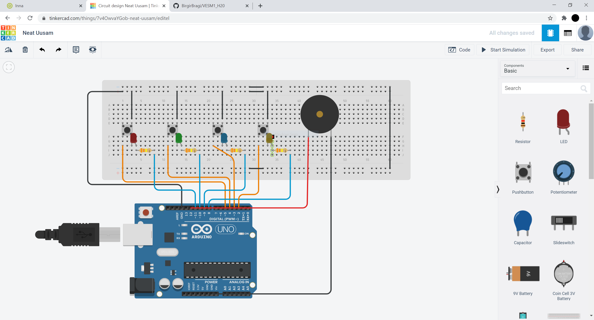

# Simon Says

Hér er hönnunarteinking sem teiknuð var í inkscape með laser cut box. Hún er frekar einföld og sýnir rauða hringi þar sem að eiga að koma göt.

Hér er ljósmynd af samsetningunni í tinkercad (brauðbretti, vírar...)

Hér er linkur á myndband þar sem að virkni frumgerðar er sýnd. Það gekk mjög illa að fá allar perurnar til þess að virka og eins og sjá má virka bara tvær í myndbandinu. Mér grunar að einhver hlutur annað hvort vír, takki eða pera sé eitthvað bilaður. Annars gekk þetta bara vel og virkar sæmilega

https://youtu.be/Z0NFLaIGCxM
