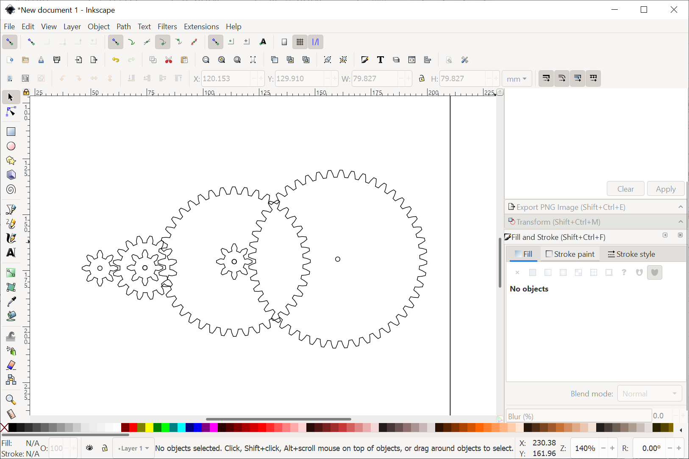
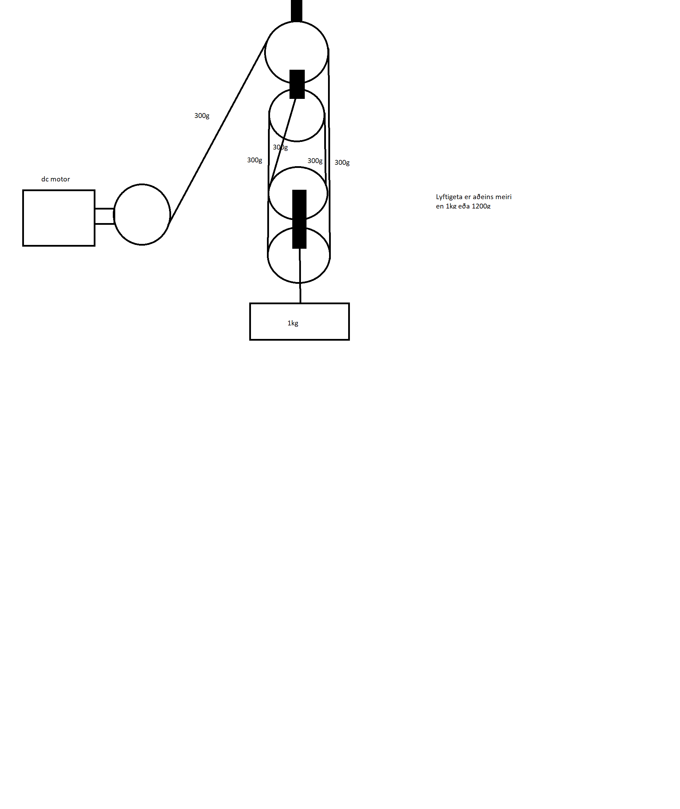

## Lýsing á verkefni

Til þess að finna út hvað þyrfti til þess að lyfta 300 grömmum byrja ég að reikna gírhlutfallið með því að deila 300g með 5g (sem er snúningsvægi mótorsins) og fæ út 60 eða 1:60. Til dæmis gæti það þá verið 1/2 x 1/5 x 1/6 eða 2x5x6 = 60. Það myndi þá líta svona út:

Þegar að búið er að finna út gírhlutfall til þess að lyfta 300 grömmum þarf núna að búa til talíu sem viðbót til þess að lyfta 1kg. Með því að fjórfalda magnið af tannhjólum í talíuni fjórfaldast einnig lyftigetan og gerir þessi talía með því mótornum kleift að lyfta 1.2kg sem er yfirdrifið nóg

